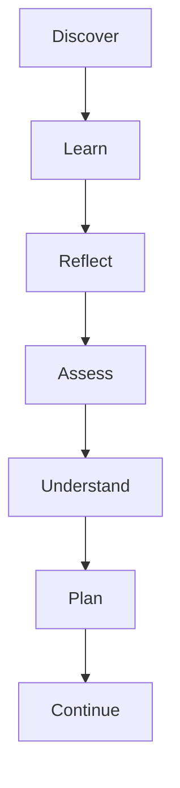
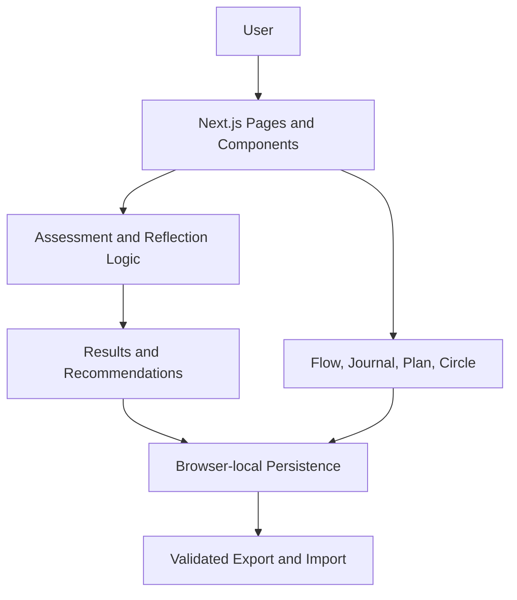

# Ikigai — The Royal Map of Purpose

**Turn self-reflection into a map for meaningful living.**

An original bilingual English–Tamil interactive experience inspired by general themes associated with Ikigai.

[](https://github.com/25mss012/ikigai-royal-map/releases/tag/v1.5.0)
[](https://github.com/25mss012/ikigai-royal-map/actions/workflows/quality.yml)
[](https://github.com/25mss012/ikigai-royal-map/actions/workflows/e2e.yml)
[](LICENSE)

**[Live Demo](https://ikigai-royal-map.vercel.app)** · **[Source Code](https://github.com/25mss012/ikigai-royal-map)** · **[Latest Release](https://github.com/25mss012/ikigai-royal-map/releases/tag/v1.5.0)**

An original bilingual English–Tamil interactive experience that helps people reflect on energy, strengths, contribution, meaningful activity, and their next small step.

## Visual preview

Real captures from the running app — click through to try each screen live:

[](https://ikigai-royal-map.vercel.app)
[](https://ikigai-royal-map.vercel.app/assessment)
[](https://ikigai-royal-map.vercel.app/assessment/results)
[](https://ikigai-royal-map.vercel.app/learn)
[](https://ikigai-royal-map.vercel.app/plan)
[](https://ikigai-royal-map.vercel.app/journal)

*Home — beginning the journey · Assessment — guided self-reflection · Results — a current reflection snapshot · Tamil — bilingual access · Plan — turning reflection into action · Journal — private ongoing reflection.*

More captures (full homepage, print stylesheet) live in [`docs/screenshots/`](docs/screenshots/).

## What it is

A private, practical, bilingual web experience for exploring purpose through reflection, small experiments, meaningful activity, planning, and connection. No account, no tracking, no backend — your data never leaves your browser.

**Who it is for:** students · career changers · professionals seeking meaning · creators · entrepreneurs · caregivers · retired people · anyone in an uncertain transition · anyone who wants one next meaningful step.

**What users can do:** learn from 20 original essays · complete a 40-question guided assessment · view a calculated reflection pattern · track flow activities · follow a 30-day plan · keep a private journal · build a support circle · export/import personal data · use English or Tamil · explore without an account, or preview everything instantly in demo mode.

**What users receive:** a clearer current snapshot (scores are reflection aids, never a verdict on identity) · practical experiment suggestions · reflection prompts · a small action plan · a private place to continue.

## Why it exists

I did not want to build another website that only explains Ikigai. I wanted to turn the ideas that inspired me into something people could actively explore, question, and apply through small everyday actions.

## Conceptual foundation

All wording below is original. Broad conceptual inspirations — not copied book content, and not claims that the app scientifically measures Ikigai:

| Theme that inspired the project | Original product interpretation |
|---|---|
| Purpose and daily meaning | Reflection prompts and a current-purpose snapshot |
| Meaningful activity | Activity exploration and practical experiments |
| Flow | Flow Lab and engagement tracking |
| Community and connection | Private support-circle exercise |
| Mindfulness and presence | Reflection prompts and attention-oriented activities |
| Continued growth | 30-day plan and learning journey |
| Resilience and imperfection | Non-judgmental progress language and flexible planning |

## How the user journey works



- **Discover:** understand the purpose of the experience.
- **Learn:** explore 20 original bilingual essays.
- **Reflect:** think about energy, values, skills, and contribution.
- **Assess:** answer 40 guided questions (1–5 scale plus “I am not sure”; autosaves, pause/resume, review screen).
- **Understand:** view dimension scores, balance, radar + circular map (always with text tables), strongest/growth areas, 3 small experiments, prompts.
- **Plan:** try small realistic actions across 7 categories; Day 30 synthesizes learning.
- **Continue:** journal, track flow, tend your circle, export/import, recalibrate anytime.

## Key features

### Reflection
- 20 original bilingual essays (insight + try-today + reflection each)
- Guided prompts throughout; 40-question assessment with transparent math
- Current results with 8 temporary archetype labels (a snapshot, not an identity)

### Action
- 30-day purpose plan (complete / kindly skip / reschedule)
- Small reversible experiments; Flow Lab with challenge-fit scoring
- Day-30 synthesis

### Private continuity
- Local browser storage (`ikigai.v1.*`) with in-memory fallback
- Private journal (search, tags, JSON/Markdown export, crisis notice)
- Editable 5-entry support circle; versioned JSON export/import with preview + explicit replace-confirm; storage migration with per-key repair and backups; delete-all controls

### Inclusive access
- Full English + Tamil UI; responsive 320px→desktop; keyboard-first with dialog focus trap + Escape + focus return; screen-reader chart alternatives; reduced motion, high contrast, 3 text sizes, light/dark; print-friendly results/plan/journal/circle

### Presentation and reliability
- One-click demo mode (sample journey, real data snapshotted and restored)
- 22 unit + 54 browser E2E tests; GitHub Actions on every push; automatic Vercel deployment; secret + copyright scans

## English + Tamil

The experience is designed for both English and Tamil users, with language switching that preserves stored progress.

| Area | English | Tamil |
|---|---:|---:|
| Core interface | Available | Available |
| Assessment (40 Qs) | Available | Available |
| Learning content (20 essays) | Available | Available |
| Results, plan, journal, circle, dashboard | Available | Available |
| Dates | en-GB | ta-IN |
| Stored data on switch | Preserved | Preserved |
| SEO metadata | English | English (by design) |

“Ikigai” is kept as-is — never forced into a misleading single-word equivalent.

## Demo mode

The assessment intro and empty dashboard offer **Try with sample data**: clearly labeled sample answers, results, flow, journal, and circle entries load instantly, with a persistent banner while active. Your real data is snapshotted first and restored byte-for-byte when you exit. While demo mode is active, export reflects the sample demonstration data shown in the demo.

## Privacy and responsible use

- No account required; personal data lives only in your browser (localStorage is convenient, **not encrypted**)
- Export, import, and delete your data anytime; nothing is publicly shared; no AI service, analytics, or trackers
- The assessment is **not** a psychological or medical test; results are reflection aids, not identity labels
- No promises about happiness, health, success, or longevity
- Independent, unofficial project inspired by general themes — see [Credits](#inspiration-and-attribution) and [`app/responsible-use`](https://ikigai-royal-map.vercel.app/responsible-use)

## Engineering highlights

Next.js 14 App Router · TypeScript strict · Tailwind · Lucide · lazy Recharts · Zod. **Local-first persistence** keeps the experience usable without accounts or a backend, while versioned export/import moves data between devices manually. **Shape guards + migration** repair single corrupt records instead of wiping users. **Lazy charts with text fallbacks** keep first load at 87.2 kB shared JS. **Bilingual architecture** (dictionary + per-field EN/TA content) means translation is data, not forks. **Print styles** turn results/plan/journal/circle into clean black-on-white pages. **Demo isolation** reuses the backup/migration layer, so sampling can't destroy real data.

## Architecture



- `app/` — routes and page-level experiences
- `components/` — reusable UI (cards, charts, dialogs, banner, header/footer)
- `data/` — questions, essays, prompts, translations, plan templates
- `lib/` — scoring, storage, migration, validation, portability, demo
- `tests/` — unit tests · `e2e/` — browser tests + fixtures
- `docs/` — case study, judge summary, demo script/shot list, screenshots
- `public/` — `icon.svg`, `favicon.ico`, social preview
- `.github/workflows/` — `quality.yml`, `e2e.yml`

## Project structure

```text
app/          Routes and page experiences
components/   Reusable UI components
data/         Questions, essays, prompts, translations
lib/          Scoring, storage, migration, validation, portability
tests/        Unit tests
e2e/          Browser tests
docs/         Case study, demo materials, screenshots
public/       Static assets
```

## Quality and testing

| Check | Result |
|---|---|
| Unit tests | **22/22** (`node:test`: migration, portability, demo bundle) |
| Browser E2E tests | **54/54** Playwright Chromium (incl. demo round-trip, Tamil, mobile, print, keyboard contract) |
| Lint | `npm run lint` clean |
| TypeScript | `npx tsc --noEmit` 0 errors |
| Production build | Clean (33 page routes incl. 20 essay pages) |
| GitHub Actions | Quality + E2E green on `main` |
| Deployment | Vercel READY, Git-connected auto-deploy, zero env vars |
| Responsive testing | 320px→desktop verified, automated overflow guards |
| Accessibility checks | Keyboard/SR/contrast/motion/size/zoom behaviors intact |
| Security scan | No secrets/tokens/keys in tree or history; headers live |
| Copyright scan | No book text, artwork, PDFs, or blocked file types |

## Quick start

Prerequisites: **Node 20+**, npm, Git.

```bash
npm install
npm run dev      # http://localhost:3000
```

Validation (exact scripts from `package.json`):

```bash
npm run lint
npx tsc --noEmit
npm run test:unit
npm run test:e2e:install  # one-time Chromium download
npm run build             # E2E runs against the production build
npm run test:e2e
npm run test:e2e:report  # open last HTML report
```

Production:

```bash
npm run build
npm run start        # http://localhost:3000
```

Screenshot regeneration: `node scripts/capture.mjs` (needs prod server; see script header).

## Documentation map

| Document | Purpose |
|---|---|
| `docs/CASE_STUDY.md` | Project motivation, design, and implementation story |
| `docs/JUDGE_SUMMARY.md` | Concise evaluation-oriented overview |
| `docs/DEMO_SCRIPT.md` | Spoken 90-second walkthrough |
| `docs/DEMO_SHOT_LIST.md` | Screen-recording sequence |
| `docs/GITHUB_METADATA.md` | Suggested repo description, topics, social-preview steps |
| `docs/screenshots/` | Real product visuals |
| `CHANGELOG.md` | Release history |

## Release information

**[v1.5.0](https://github.com/25mss012/ikigai-royal-map/releases/tag/v1.5.0)** — demo mode, journey strip, About story, portfolio docs (see [CHANGELOG.md](CHANGELOG.md) for full history back to 1.0.0).

## Roadmap

- **Exploring:** additional language coverage beyond Tamil
- **Planned:** opt-in gentle reminders (no streak pressure)
- **Planned:** more import/export conveniences
- **Future:** PWA/offline support only after a full privacy review
- **Future:** wider usability testing across age groups

Ideas, not promises — privacy and simplicity come first.

## Inspiration and attribution

Conceptually inspired by ***Ikigai: The Japanese Secret to a Long and Happy Life* by Héctor García and Francesc Miralles** — thank you for the ideas about purpose, flow, community, and resilience. **This is an independent, unofficial project inspired by general themes associated with Ikigai. It is not affiliated with, sponsored by, or endorsed by the authors or publisher.** No chapters, passages, illustrations, tables, diagrams, or PDFs from the book are reproduced; every essay, question, score, and visual is original. If the book moved you, please buy and read it.

## Contributing

See [CONTRIBUTING.md](CONTRIBUTING.md) — calm, accessible, private contributions only: no book text, no accounts-required features, keyboard + screen-reader support for every interaction, natural Tamil, and `lint` + `tsc` + `build` green before pushing. Security issues: see [SECURITY.md](SECURITY.md).

## License

[MIT](LICENSE) — © 2026 Ikigai — The Royal Map of Purpose contributors. Original educational content; see license file for terms.

## Final links

- **Live Demo:** https://ikigai-royal-map.vercel.app
- **Source Code:** https://github.com/25mss012/ikigai-royal-map
- **Latest Release:** https://github.com/25mss012/ikigai-royal-map/releases/tag/v1.5.0
- **Privacy:** https://ikigai-royal-map.vercel.app/privacy · **Accessibility:** https://ikigai-royal-map.vercel.app/accessibility · **Responsible use:** https://ikigai-royal-map.vercel.app/responsible-use
