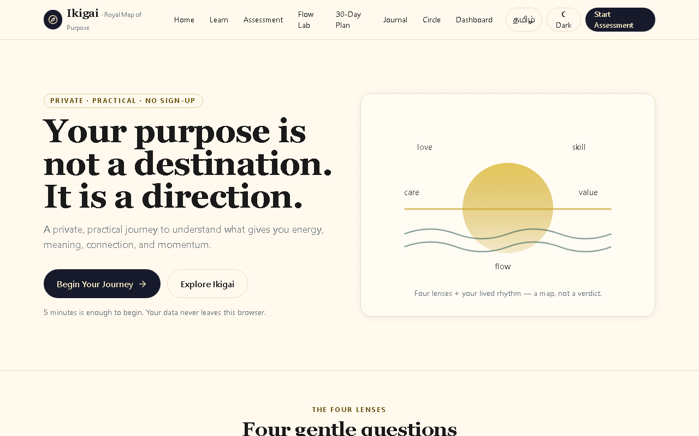
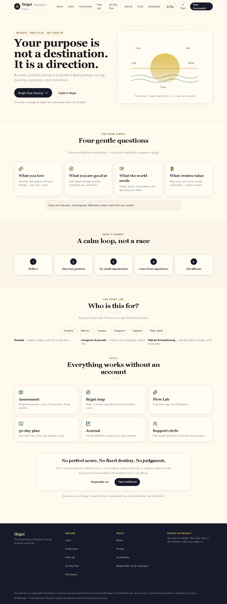
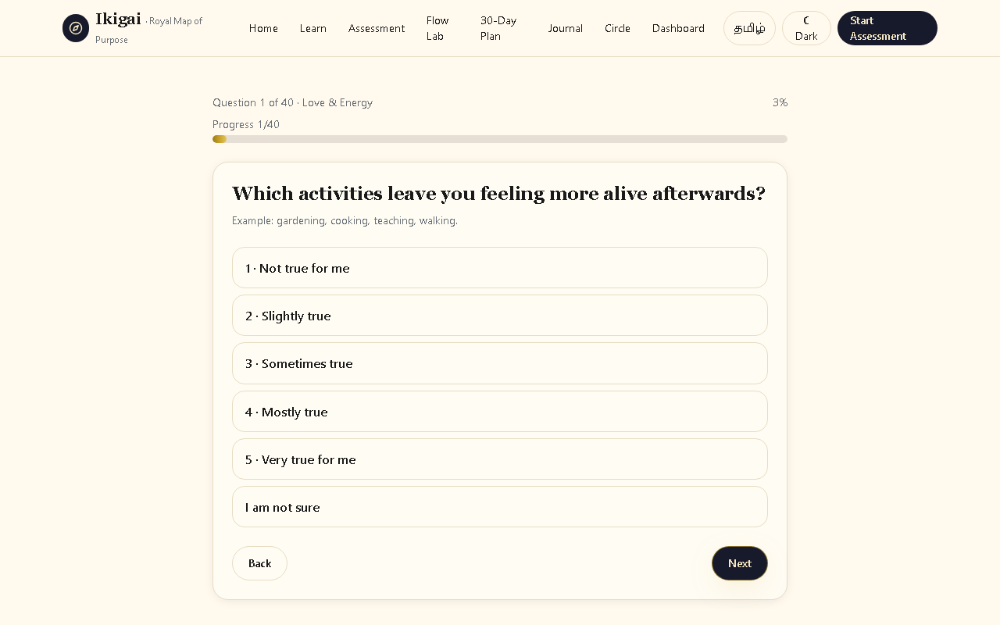
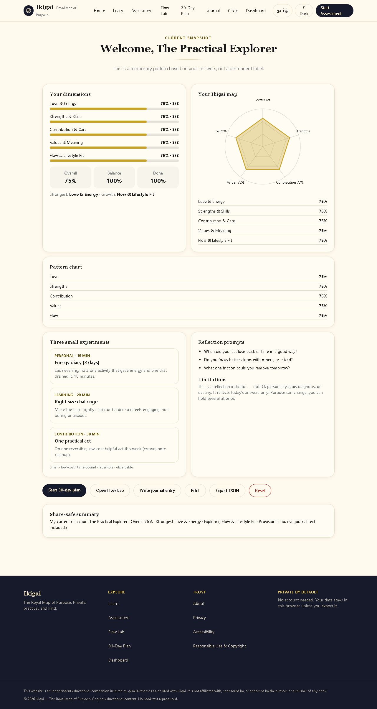
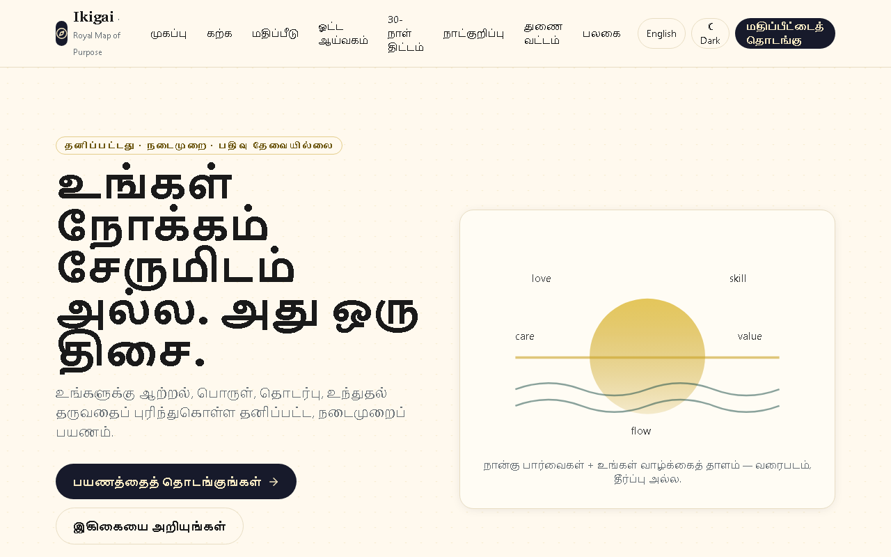
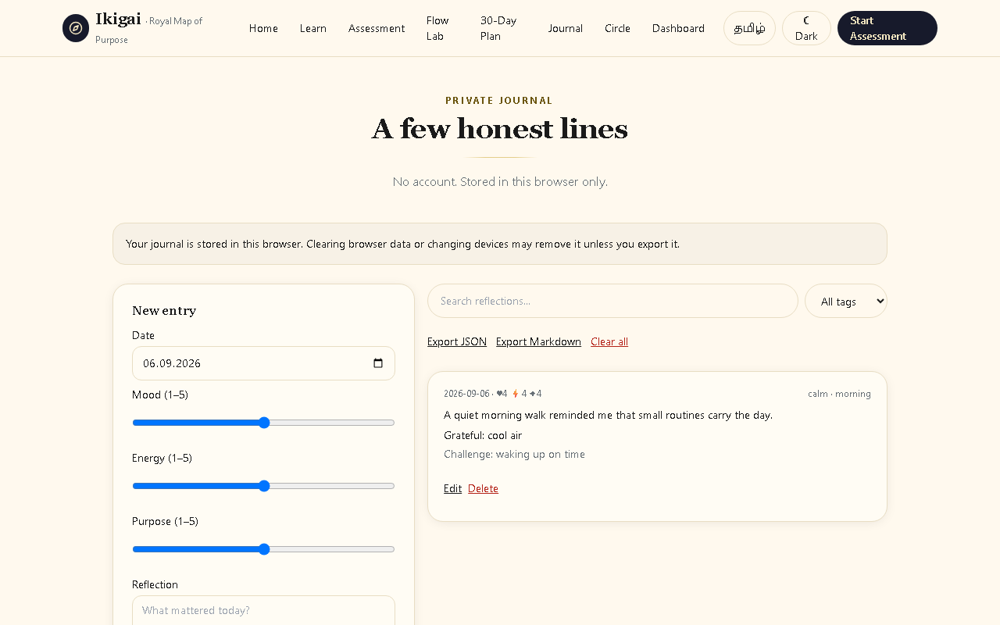
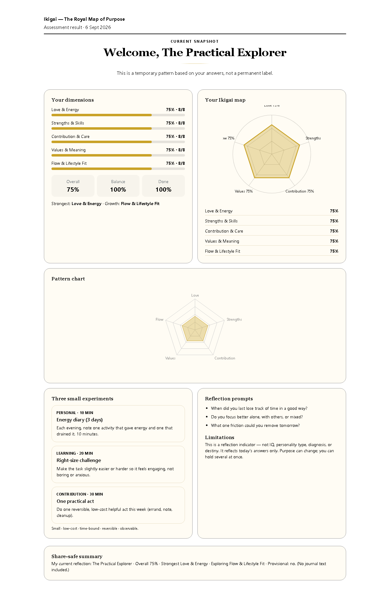

# IKIGAI — The Royal Map of Purpose

> **Turn self-reflection into a map for meaningful living.**

**Ikigai Royal Map is an original bilingual English–Tamil interactive self-reflection experience inspired by the ideas explored in Héctor García and Francesc Miralles' book *Ikigai: The Japanese Secret to a Long and Happy Life*.** It is a private, practical web companion — no account, no tracking, no backend — that helps anyone discover what gives their life meaning, energy, connection, and direction.

- **Live:** https://ikigai-royal-map.vercel.app
- **Repo:** https://github.com/25mss012/ikigai-royal-map

## Visual Preview

Real captures from the running app (`docs/screenshots/`, regenerated with `node scripts/capture.mjs`):









## Why I Built This

Books end; life doesn't. Reading about purpose is easy, but *practicing* it is hard — especially across languages, ages, and life situations. This project transforms the book's ideas into an interactive digital experience: instead of turning pages, you answer gentle questions, see your own pattern drawn as a map, run tiny real-world experiments, write private reflections, and build a 30-day plan. The philosophy stays the same; the medium becomes something you can touch, revisit, and act on — in English or Tamil, in five minutes or fifty.

## Conceptual Foundation

All wording below is original. The app draws on these general ideas from the book and reinterprets each as a tool:

| Book-inspired idea | Original interpretation in this app |
|---|---|
| Ikigai as a reason for being / reason to get up | Daily-meaning essay + morning journal prompts; purpose framed as direction, not destination |
| The four-area diagram (love, skill, need, value) | Four reflection *lenses* — prompts, not a test of worth; the artwork is an original SVG wheel, never the book's diagram |
| Flow and deep engagement | Flow Lab: focus × joy × challenge-fit scoring with friction-reduction advice |
| Staying active and engaged | 30-day plan of small Explore/Learn/Create/Serve/Connect/Restore/Reflect steps |
| Community and belonging | Private 5-entry support circle built on reciprocity (no social network) |
| Mindfulness and presence | Attention essays + 3-breath micro-practices, framed as wellbeing info, not therapy |
| Resilience through difficulty | Imperfection-positive copy (“a skipped day is data”), provisional results, crisis signposting |
| Continuous learning | 21 original essays, each ending in a 5-minute activity and reflection question |

Scores are always labeled *current snapshots* and *temporary patterns* — never diagnoses, destinies, or personality types.

## How It Works

**Discover → Reflect → Assess → Understand → Journal → Plan → Continue**

1. **Discover** — read 21 short bilingual essays (insight + try-today + reflection each).
2. **Reflect** — answer 40 gentle questions across 5 dimensions (1–5 scale plus “I am not sure”; autosaves, pause/resume, review screen).
3. **Assess** — submit for an honest snapshot: dimension scores, balance, overall indicator, provisional flag when incomplete.
4. **Understand** — explore your radar chart + circular Ikigai map (always paired with text tables), strongest/growth areas, 3 small experiments, and reflection prompts.
5. **Journal** — keep private mood/energy/purpose entries with tags, gratitude, search, and JSON/Markdown export.
6. **Plan** — generate a 30-day plan; complete, kindly skip, or reschedule days; Day 30 synthesizes learning.
7. **Continue** — track flow, tend your support circle, export/import your data, and recalibrate anytime. Purpose can change; the map updates with you.

## Key Features

- 40-question assessment (5 dims × 8) with transparent math: `avg = sum/n`, `pct = ((avg−1)/4)×100`, `balance = 100−(max−min)`; 8 temporary archetypes
- Interactive radar + SVG Ikigai wheel with screen-reader text fallbacks; print/JSON export; share-safe summary (never leaks journal text)
- Flow Lab (`challengeFit = 5−|difficulty−confidence|`), weekly trends, “reduce friction” coaching
- 30-day plan with Day-30 synthesis; private journal with crisis notice; 5-entry support circle (now editable)
- Versioned export/import (`ikigai-export v1`, Zod-validated, preview + explicit replace-confirm, prefs opt-in)
- Storage migration layer (`ikigai.v1.meta`): corrupt records reset singly with timestamped backups; valid data never wiped
- Privacy/status dashboard card, accessibility settings, responsible-use & copyright pages, custom 404

## Tamil + English Experience

~100% of user-facing UI in both languages: navigation, homepage, all 21 essays (body, insight, activities, reflections), all 40 questions + examples + scale, results (headings, archetype glosses, experiments, prompts), every tool label, validation/empty-state/import/export messages, trust pages, 404. “Ikigai” is kept as-is (no misleading single-word equivalent). `ta-IN`/`en-GB` date formatting. Switching languages never loses saved data.

## Accessibility & Responsive Design

Skip link, landmarks, heading order, visible focus rings, full keyboard operation (incl. dialog focus trap + Escape + focus return), 44px touch targets, labelled errors announced via `role=alert`, no colour-only meaning, chart text alternatives, reduced-motion + high-contrast + 3 text sizes + light/dark, 200%-zoom-safe. Verified layouts from **320px to desktop** (automated overflow guards at 320px, incl. Tamil XL-text).

## Testing & Quality

- **51/51** Playwright Chromium E2E (navigation, mobile menu, 404, full assessment journey, results safety, flow math, plan lifecycle, journal CRUD/search/export, circle guard, dashboard, prefs, import robustness, Tamil journeys, mobile, print, dialog keyboard contract)
- **18/18** `node:test` unit tests (migration + portability schemas)
- `npm run lint` clean · `npx tsc --noEmit` 0 errors · `npm run build` clean (**41 routes**)
- **87.2 kB** shared JS · lazy-loaded charts · static essays · SVG-only artwork · `next/font`
- Security headers verified live (`nosniff`, `Referrer-Policy`, `Permissions-Policy`, `SAMEORIGIN`); secret + copyright scans in CI
- **18/18 production routes + custom 404 verified** on the live deployment

## Technical Highlights

Next.js 14 App Router · TypeScript strict · Tailwind CSS · Lucide icons · Recharts (lazy) · Zod · versioned localStorage (`ikigai.v1.*`) with in-memory fallback · CSS-only motion · zero backend/auth/analytics/keys. CI: `quality.yml` (secret scan → lint → typecheck → unit → build) + `e2e.yml` (Chromium, full browser suite, reports on failure only). Capture script `scripts/capture.mjs` regenerates launch screenshots from the real app.

```bash
npm install
npm run dev      # http://localhost:3000
npm run lint && npm run typecheck && npm run test:unit
npm run test:e2e:install  # one-time Chromium
npm run build && npm run test:e2e
npm run start
```

## Data portability and recovery

Format `{ "format": "ikigai-export", "version": 1, ... }` — your data only. Import: JSON-only, 5 MB cap, Zod-validated, per-section preview; **confirming replaces** matching browser data (download current first; prefs restored only if ticked). Invalid files leave data untouched. localStorage is convenient, not encrypted — export before clearing browser data or changing devices.

## Deployment workflow

Production branch is `main`; Vercel project `ikigai-royal-map` is Git-connected (Next.js auto-detected, no env vars):

```bash
git add . && git commit -m "describe the change" && git push origin main
```

## Limitations

Single-device storage (by design — no server); SEO metadata in English; E2E covers Chromium; print tested via print-media emulation; no offline support (installable PWA metadata only, deliberately no service worker); not medical, career, financial, or religious advice.

## Credits / Inspiration

Conceptually inspired by ***Ikigai: The Japanese Secret to a Long and Happy Life* by Héctor García and Francesc Miralles** — thank you for the ideas about purpose, flow, community, and resilience. This is an **independent, unofficial interpretation**: not created, endorsed, or sponsored by the authors or publisher. No text, illustrations, or diagrams from the book are reproduced here; every essay, question, score, and visual is original. If the book moved you, please buy and read it.

## Security note: never commit credentials

`.env`, `*.pem`, `*.pdf` are ignored; CI fails on token patterns or blocked file types. The app needs no secrets at all. A removed token may still be valid — rotate it from the provider dashboard immediately. (Maintainer reminder: rotate any credential ever pasted outside its dashboard.)
